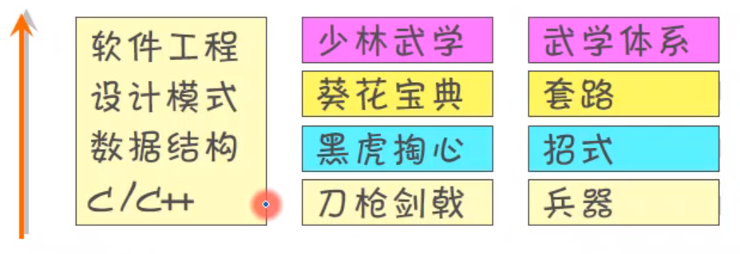
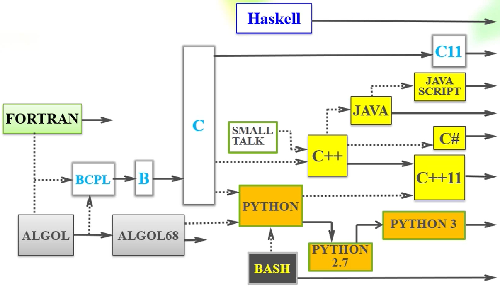
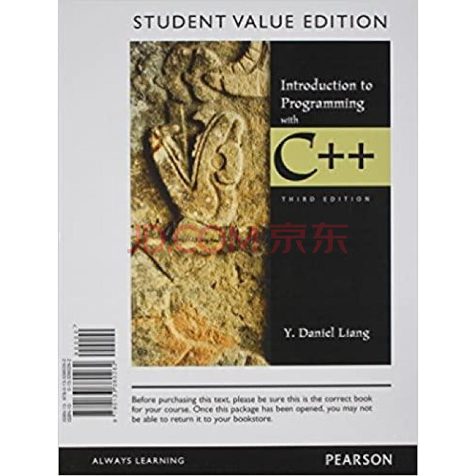
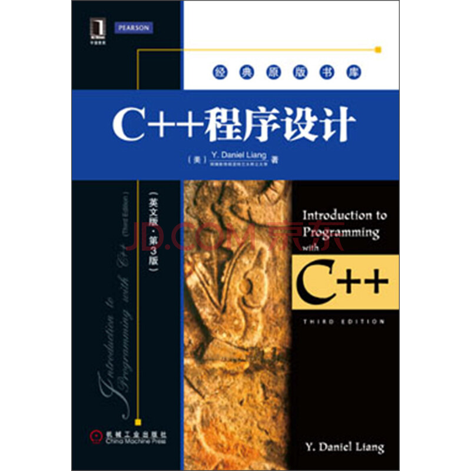
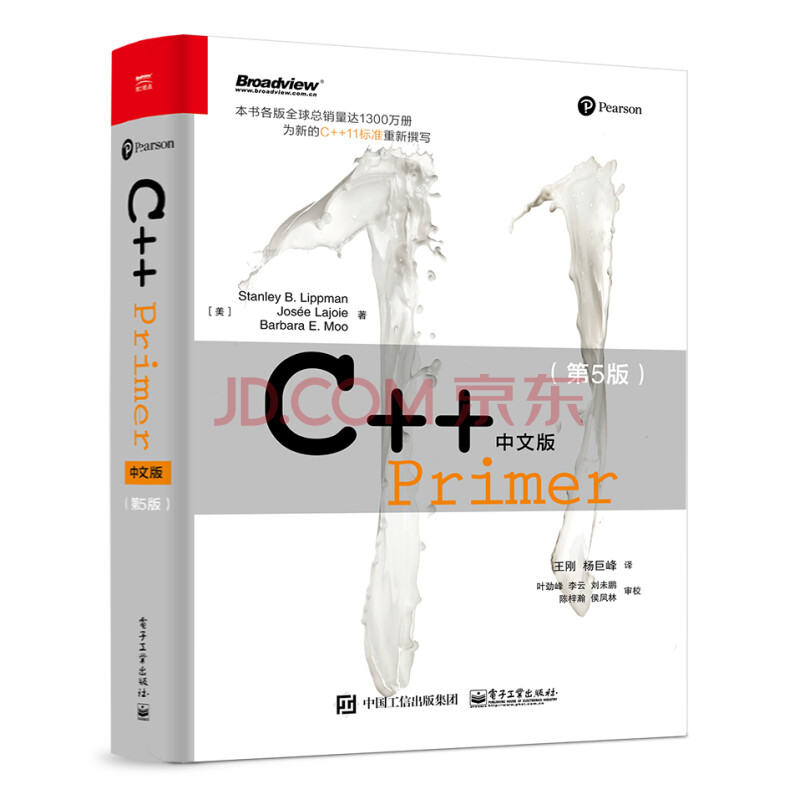
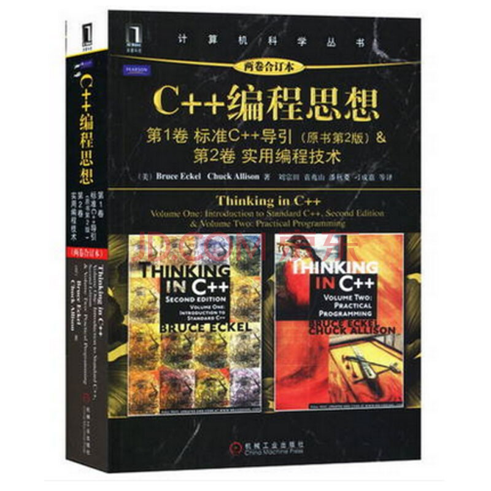
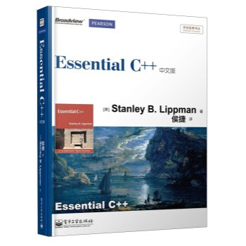
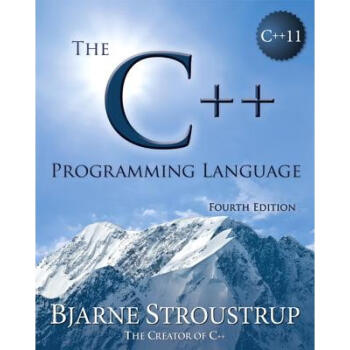
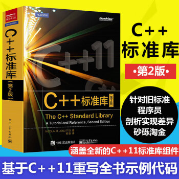
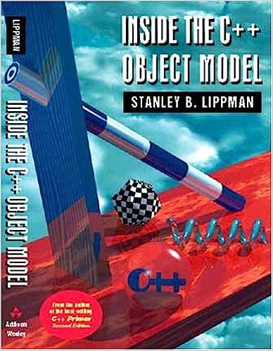

# 0、引言

[本专栏](https://blog.csdn.net/ymgogre/category_12383901.html)的系列文章是在学习 [北京邮电大学](https://www.bupt.edu.cn/) [崔毅东](https://teacher.bupt.edu.cn/cyd) 老师的《[C++程序设计 (面向对象进阶)](https://www.icourse163.org/course/BUPT-1003564002?tid=1463116453)》课程过程中整理的。**欢迎前往[专栏](https://blog.csdn.net/ymgogre/category_12383901.html)了解更多相关内容~** 😀

有关于现代 C++ 的基本介绍，请前往《[现代C++基本介绍](https://blog.csdn.net/YMGogre/article/details/130971095)》！

> 🔔 **先决条件**
>
> **[本专栏](https://blog.csdn.net/ymgogre/category_12383901.html)的系列文章并不适合从未接触过编程的同学，读者需要确保自己已经具备编程基础（特别是 C++ 基础）！您可以参考笔者的「[面向对象程序设计(基础)](https://blog.csdn.net/ymgogre/category_12002686.html)」专栏了解 C++ 基础的相关内容。**

# 1、导论

* ***C++*** 即 ***C Plus Plus*** 即 ***CPP***
* C++ 之父：***[Bjarne Stroustrup](https://www.stroustrup.com/)***
* 如果读者还不会念他的名字，那么可以请他本人亲自[教授一下](https://www.stroustrup.com/pronounciation.wav)哦( •̀ ω •́ )✧（不是
* C/C++ 在计算机科学中所处的位置： 

> **先导知识**
> * 计算机专业导论
>   * 计算机基本结构
>   * 布尔代数
> * C 语言/ Java 语言
>   * 数据类型、运算符、表达式
>   * 分支、循环
>   * 函数、数组、引用、指针(C 语言)
>
> **后续学习**
> * 数据结构、面向对象系统分析与设计
> * 数据库原理、计算机网络
> * 计算机组成原理、操作系统
> * 软件工程

# 2、C++ 编程范式（Programming Paradigm）

<dl>
<dt><a href="https://zh.wikipedia.org/wiki/%E7%BC%96%E7%A8%8B%E8%8C%83%E5%9E%8B">编程范式</a></dt>
<dd>规范编程的一系列思想、方法以及程序设计语言构造块所构成的一种模式。</dd>
</dl>

---

C++ 是一门复杂的语言，支持多种编程范式。换句话来说，我们可以使用 C++ 编写多种不同风格的程序来。下面介绍几种 C++ 支持的编程范式：

<dl>
<dt>Structural Programming 结构化编程</dt>
<dd>任何函数都可以直接访问所有数据，数据是完全暴露的。</dd>
<dt>Object-Oriented Programming 面向对象编程</dt>
<dd>对象应该是封装起来的受保护的，对象里面的数据是不被别人直接访问的。对象通过接口(Interface)来和外界打交道。</dd>
<dt><a href="https://zh.wikipedia.org/wiki/%E6%B3%9B%E5%9E%8B%E7%BC%96%E7%A8%8B">Generic Programming 泛型编程</a></dt>
<dd>在 C++ 中，泛型编程通常使用模板实现。这个时候，"类型"（type）成为了模板的参数。</dd>
<dt><a href="https://zh.wikipedia.org/wiki/%E5%87%BD%E6%95%B0%E5%BC%8F%E7%BC%96%E7%A8%8B">Functional Programming 函数式编程</a></dt>
<dd>在 C++ 中，函数式编程通常使用 Lambda 表达式实现。它将计算机运算视为函数运算，并且避免使用程序状态以及易变对象。它是面向数学的抽象，将计算描述为一种表达式求值。其实，函数式程序就是一个表达式。</dd>
</dl>

# 3、语言演化与标准

本门课程要介绍的 C++ 是 C++11 之后的 C++，在此之前，高级编程语言已经经历了长足的发展。如下是部分高级语言之间的演化关系： 
> 📌 **Haskell**
> 
> 在这张图中，最顶上的 [Haskell](https://www.haskellcn.org/) 语言是如此的“孤独”。它是一门纯粹的函数式编程语言，没有面向对象的概念。后续在学习到编程语言的高级阶段时，我们会逐步接触“函数式编程”这一概念的。

---

<dl>
</dt>C++ 标准发布时间</dt>
<dd>请参阅《<a href="https://blog.csdn.net/YMGogre/article/details/130971095">现代C++基本介绍</a>》</dd>
</dl>

**本课程主要在 C++11、C++14、C++17 三代标准的基础之上介绍 C++ 的特性**。

# 4、C++ 开发工具

C++ 作为一门[编译型语言](https://zhuanlan.zhihu.com/p/37721614)，通常需要考虑如下几类开发工具：
* Editor 编辑器
* Compiler 编译器
* Linker 链接器

当然，如果嫌麻烦的话可以直接使用 **IDE** (**I**ntegrated **D**eveloping **E**nvironment) [集成开发环境](https://zh.wikipedia.org/wiki/%E9%9B%86%E6%88%90%E5%BC%80%E5%8F%91%E7%8E%AF%E5%A2%83)。

> 💬 在使用 IDE 进行开发时，我们应尽量选择其最新版本，以获得更加现代化和智能化的开发体验。

下面是一些推荐的 IDE：
* [Visual Studio](https://visualstudio.microsoft.com/zh-hans/)
* [Eclipse CDT](https://projects.eclipse.org/projects/tools.cdt) + [Gcc](https://gcc.gnu.org/)
* [Visual Studio Code](https://code.visualstudio.com/) + [Gcc](https://gcc.gnu.org/)/[Clang](https://clang.llvm.org/)
* [XCode](https://developer.apple.com/cn/xcode/) (Mac)

> 💬 如果你需要安装 IDE 并运行第一个 C++ 程序的教程，请参考：
>
> [**在 Visual Studio 上开启自己的 C++ 学习之旅**](https://blog.csdn.net/YMGogre/article/details/127224211)

有关几款 IDE 的使用介绍，请参考崔毅东老师的教学视频，本文不再花大篇幅阐述：
* [Visual Studio 介绍](https://www.icourse163.org/learn/BUPT-1003564002?tid=1463116453#/learn/content?type=detail&id=1240288103&cid=1261623919&replay=true)（🧭 第1单元 第03节）
* [Eclipse 介绍](https://www.icourse163.org/learn/BUPT-1003564002?tid=1463116453#/learn/content?type=detail&id=1240288104&cid=1261623925&replay=true)（🧭 第1单元 第04节 1.2演示）

> 📌 **安装 GCC**
>
> 针对 C++ 语言，Eclipse CDT 和 Visual Studio Code 本质上来说都只提供编辑功能，他们并不能直接编译、链接 C++ 程序。因此，使用这两款开发工具还需要安装第三方的编译器和链接器，才能够合作形成 C++ 的集成开发环境。 在 Windows 平台下，我们可以尝试安装 GCC 编译器套件的 Windows 移植版 —— [MinGW (MinGW-W64)](https://www.mingw-w64.org/)、[Msys (Msys2)](https://www.msys2.org/) 或 [CygWin](https://www.cygwin.com/)。

相关工具的安装教程，请参考崔毅东老师的教学视频，本文不再花大篇幅阐述：
* [安装 MinGW-W64 和 Msys2 工具](https://www.icourse163.org/learn/BUPT-1003564002?tid=1463116453#/learn/content?type=detail&id=1240288104&cid=1261623929&replay=true)（🧭 第1单元 第04节 2.2演示、3.2演示）

## 4.1、在 Eclipse 中配置 GCC 编译器

请参考崔毅东老师的[教学视频](https://www.icourse163.org/learn/BUPT-1003564002?tid=1463116453#/learn/content?type=detail&id=1240288104&cid=1261623932&replay=true)（🧭 第1单元 第04节 4.2演示）

## 4.2、Eclipse 工程和[工作空间](https://www.runoob.com/eclipse/eclipse-workspaces.html)

请参考崔毅东老师的[教学视频](https://www.icourse163.org/learn/BUPT-1003564002?tid=1463116453#/learn/content?type=detail&id=1240288104&cid=1261623933&replay=true)（🧭 第1单元 第04节 4.3演示）

# Q：如何学习 C++？

### A：Practice! 实践！

# 参考书目

* 适用于无任何基础的初学者：

    * 《[Introduction to Programming with C++](https://search.jd.com/Search?keyword=Introduction%20to%20Programming%20with%20C%2B%2B&enc=utf-8&pvid=c61a67af9f7f40b0a1889f3a9bef58ca)》(3rd Ed.), Y.Daniel Liang 
    * 《[C++ 程序设计](https://search.jd.com/Search?keyword=C%2B%2B%20%E7%A8%8B%E5%BA%8F%E8%AE%BE%E8%AE%A1%20%E6%A2%81%E5%8B%87&enc=utf-8&wq=C%2B%2B%20%E7%A8%8B%E5%BA%8F%E8%AE%BE%E8%AE%A1%20%E6%A2%81%E5%8B%87&pvid=a60a09e95863457fa7908c14478a7faf)》(第3版)，梁勇 

---

* 适用于有恒心的读者：

    * 《[C++ Primer](https://search.jd.com/Search?keyword=C%2B%2B%20Primer&enc=utf-8&wq=C%2B%2B%20Primer&pvid=bbb7c2709abd4c64a053ac7966f48224)》(5rd Ed.), Stanley B.Lippman等 

---

* 适用于已入门的读者：

    * 《[Thinking in C++](https://search.jd.com/Search?keyword=Thinking%20in%20C%2B%2B&enc=utf-8&wq=Thinking%20in%20C%2B%2B&pvid=6a7273bdc05f4f0bac27defce4fb62b5)》(2nd Ed.), Volume 1, Bruce Eckel 

    > [电子英文版](https://www.mindviewllc.com/quicklinks/#c)

    * 《[Essential C++](https://search.jd.com/Search?keyword=Essential%20C%2B%2B&enc=utf-8&wq=Essential%20C%2B%2B&pvid=26bb70dd0a7e429da76d5ee058589bb4)》, Stanley B.Lippman 

---

* 适用于当字典：

    * 《[The C++ Programming language](https://search.jd.com/Search?keyword=The%20C%2B%2B%20Programming%20language&enc=utf-8&wq=The%20C%2B%2B%20Programming%20language&pvid=053d6fd2cda944f599cda4a30f0172af)》, Bjarne Stroustrup 

---

* 适用于课后拓展：

    * 《[The C++ Standard Library](https://search.jd.com/Search?keyword=The%20C%2B%2B%20Standard%20Library&enc=utf-8&wq=The%20C%2B%2B%20Standard%20Library&pvid=ced0024fb0914d6e8895fc8947eb890d)》, Nicolai M. Josuttis 

    > 直接进行一个 C++ 标准库的学习( •̀ ω •́ )✧

    * 《[Inside C++ Object Model](https://www.amazon.com/Inside-Object-Model-Stanley-Lippman/dp/0201834545)》, Stanley B.Lippman 

    > 从编译器的角度来探讨 C++ 的实现方法和优缺点。