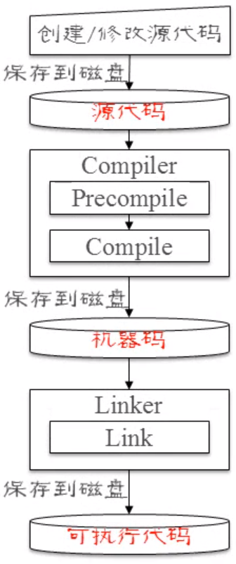

# 0、引言

[本专栏](https://blog.csdn.net/ymgogre/category_12383901.html)的系列文章是在学习 [北京邮电大学](https://www.bupt.edu.cn/) [崔毅东](https://teacher.bupt.edu.cn/cyd) 老师的《[C++程序设计 (面向对象进阶)](https://www.icourse163.org/course/BUPT-1003564002?tid=1463116453)》课程过程中整理的。<font color="#FF9999">**欢迎前往[专栏](https://blog.csdn.net/ymgogre/category_12383901.html)了解更多相关内容~**</font> 😀

有关于现代 C++ 的基本介绍，请前往《[现代C++基本介绍](https://blog.csdn.net/YMGogre/article/details/130971095)》！

> 🔔 **先决条件**
>
> <font color="#008000">**[本专栏](https://blog.csdn.net/ymgogre/category_12383901.html)的系列文章并不适合从未接触过编程的同学，读者需要确保自己已经具备编程基础（特别是 C++ 基础）！您可以参考笔者的「[面向对象程序设计(基础)](https://blog.csdn.net/ymgogre/category_12002686.html)」专栏了解 C++ 基础的相关内容。**</font>

# 1、C++ 源文件与编码规范

## 1.1、代码文件分类

与 C 语言类似，C++ 的代码文件同样分为两类：
1. Header file 头文件
2. Source file 源文件

| C | C++ |
|---| --- |
| hello.h<br>hello.c | hello.h<br><font color="#ff4500">hello.hpp</font><br>hello.cpp<br><font color="#ff4500">hello.cxx</font> |
> 在一些其他环境中（比如 Linux），后缀名可能会诸如 `.hpp`、`.cxx`。

## 1.2、C++ 编码规范

> 📌 <font color="#FF6699">**Why Coding Conventions**</font>
>
> 为了让程序具备更好的可读性，避免程序难以维护

---


<dl>
    <dt>Google 开源项目风格指南</dt>
    <dd><a href="https://github.com/google/styleguide" title="StyleGuide">英文原版</a><br><a href="https://github.com/zh-google-styleguide/zh-google-styleguide" title="风格指南">中文版</a><br>其中 C++ 规范 5 万多字，过于庞大</dd>
</dl>

---


<dl>
    <dt>geosoft.no 编码风格指南</dt>
    <dd><a href="http://geosoft.no/development/cppstyle.html" title="CppStyle">英文原版</a><br>只有英文版，但要相对简明一点<br>4.9 版本有 94 条规则</dd>
</dl>

> 在后续的学习中，我们会逐步了解其中一些编码规范

---

## 1.3、回望第一个 C++ 程序

在基础阶段我们编写自己的[第一个 C++ 程序](https://blog.csdn.net/YMGogre/article/details/127224211#t6)是一个控制台打印 "Hello World!" 的程序，它的代码如下：

```c++
#include <iostream>
using namespace std;
 
int main() {
    cout << "Hello World!" << endl;    
 
    return 0;
}
```

基于这个最简单的 C++ 程序，其实也包含了一些编码规范：

> 📃 <font color="#0000CD">38. Special characters like TAB and page break must be avoided.<br>📃 38. 必须避免使用“制表”和“分页”等特殊字符</font>
>> 因此，在 IDE 中，将“制表符”设置并替换为 4 个空格，可达到同样的缩进效果

> 📃 <font color="#0000CD">68. Functions must always have the return value explicitly listed.<br>📃 68. 函数必须总是将返回值明确列出</font>
>> 在 C++ 中，（只有）返回类型为 int 的函数允许不包含 return 语句，并且不会导致编译错误。此时函数会默认返回一个未定义的值，但这不是一种良好的实践

此外，在这个程序中，我们使用 `#include <iostream>` 包含了一个头文件。与 C 语言不同，早在 C++98 的时候，包含头文件就没有 `.h` 后缀了，通常只是包含文件的名称。

## 1.4、C++ 代码注释

在 C++ 中，可以添加多种注释：

<dl>
    <dt>行尾注释</dt>
    <dd>在代码行的末尾添加注释。这些注释从代码的末尾延伸到行尾</dd>
<dl>

```c++
int a = 20;  //这是一个行尾注释
```

---

<dl>
    <dt>单行注释</dt>
    <dd>以双斜杠 <code>//</code> 开始，知道行尾的内容都被视为注释</dd>
</dl>

```c++
//这是一个单行注释
int a = 20;
```

---

<dl>
    <dt>多行注释</dt>
    <dd>以 <code>/*</code> 开始，以 <code>*/</code> 结束，中间的内容都被视为注释。多行注释可以跨越多行代码</dd>
</dl>

```c++
/* 这是一个
   多行注释 */
int a = 20;
```

---

<dl>
    <dt>文档注释 (Doxygen 风格)</dt>
    <dd>通常用于生成文档。以 <code>/**</code> 开头，以 <code>*/</code> 结束，可以包含与函数、类、变量等相关的说明文本</dd>
</dl>

```c++
/**
 * @brief 函数说明
 * @param x 参数 x 的说明
 * @return 返回值的说明
 */
int myFunction(int x){
    //函数体
    return x * 2;
}
```

## 1.5、Visual Studio 将当前选中项目设置为启动项目

参考 [MSDN](https://learn.microsoft.com/zh-cn/visualstudio/get-started/csharp/run-program?view=vs-2022#start-from-a-project) 运行 [C#](https://learn.microsoft.com/zh-cn/dotnet/csharp/tour-of-csharp/) 项目的介绍<br>或者<br>崔毅东老师的[教学视频](https://www.icourse163.org/course/BUPT-1003564002?tid=1463116453)（🧭 第2单元 第02节 2.2演示）

## 1.6、Visual Studio 设置多个启动项目

参考 [MSDN](https://learn.microsoft.com/zh-cn/visualstudio/ide/how-to-set-multiple-startup-projects?view=vs-2022) 中的相关介绍

## 1.7、Visual Studio 对项目进行分组管理

Visual Studio 的[解决方案资源管理器](https://learn.microsoft.com/zh-cn/visualstudio/ide/use-solution-explorer?view=vs-2022)支持通过创建“解决方案文件夹”（也称为“[解决方案筛选器](https://learn.microsoft.com/zh-cn/shows/visual-studio-toolbox/solution-filters-in-visual-studio)”）的方式对项目进行分组管理。具体操作可以参考崔毅东老师的[教学视频](https://www.icourse163.org/course/BUPT-1003564002?tid=1463116453)（🧭 第2单元 第02节 2.3演示）

> 有关“解决方案文件夹”的[注意事项](https://www.zhihu.com/question/29823700)

# 2、命名空间/名字空间 Name Space

<dl>
    <dt><a href="https://learn.microsoft.com/zh-cn/cpp/cpp/namespaces-cpp?view=msvc-170" title="命名空间 (C++) | Microsoft Learn">NameSpace</a></dt>
    <dd>中文译作“<font color="#dd0000">命名空间</font>”或者“<font color="#dd0000">名字空间</font>”；比如 <code>std::cout</code> 中的 <code>std</code> 就是命名空间。命名空间是一个声明性区域，为其内部的标识符（类型、函数和变量等的名称）提供一个范围。</dd>
    <dt><a href="https://learn.microsoft.com/zh-cn/cpp/cpp/namespaces-cpp?view=msvc-170#using_directives" title="命名空间 (C++) | Microsoft Learn">using 指令</a></dt>
    <dd>通过 <code>using</code> 指令，可使用 <code>namespace</code> 中的所有名称，而不需要 namespace-name 为显式限定符。比如我们在 <a href="#13回望第一个-c-程序" title="回望第一个 C++ 程序">1.3 小节</a>的代码演示。</dd>
</dl>

> 📌 <font color="#FF6699">**using namespace std**</font>
>
> 在 C++ 编程中，通常不推荐直接使用 `using namespace std;`，而是更倾向于明确指定命名空间中的标识符，或者使用特定的 `using` 语句，如 `using std::cout;` 或 `using std::cin;`。这是因为 `using namespace std;` 会引入整个 `std` 命名空间中的所有标识符，可能会导致一些问题和不必要的冲突：
> 1. 命名冲突：`std` 命名空间中可能包含与您的程序中的其他命名空间或您自己的代码中的标识符冲突的名称。这可能导致编译错误或不明确的行为。
> 2. 可读性和维护性：使用 `using namespace std;` 可能会使代码更难以阅读和维护，因为您无法轻松地确定来自哪个命名空间的特定标识符。
> 3. 潜在的性能问题：引入整个 `std` 命名空间中的标识符可能会导致编译器需要更多的时间来查找标识符的定义，尤其在大型项目中。

更推荐的做法是使用特定的 `using` 语句，以引入需要的标识符，例如：

```c++
#include <iostream>

using std::cout;
using std::endl;

int main() {
    cout << "Hello World!" << endl;

    return 0;
}
```

# 3、编译 C++ 程序的步骤

如下所示流程图展示了创建并编译 C++ 程序的一般步骤：

<div align="center"></div>

> <dl>
>       <dt>Precompile</dt>
>       <dd><font color="dd0000">预处理</font>/<font color="dd0000">预编译</font>，主要做一些代码文本的替换工作</dd>
>       <dt>Compile</dt>
>       <dd><font color="dd0000">编译</font>，将源代码生成机器码 Object file (目标文件), 例如 "Welcome.obj" (Windows 平台)</dd>
>       <dt>Link</dt>
>       <dd><font color="dd0000">链接</font>，将目标文件和外部库链接为一个可执行文件，例如 "Welcome.exe" (Windows 平台)</dd>
> </dl>

# 4、处理错误

<dl>
    <dt>Error Classification 错误分类</dt>
    <dd><ul><li>Syntax Error <font color="dd0000">语法错误</font></li><li>Runtime Error <font color="dd0000">运行时错误</font></li><li>Logic Error <font color="dd0000">逻辑错误</font></li></ul></dd>
    <dt>语法错误</dt>
    <dd><ul><li>违反了编程语言的语句形式或使用规则，一般由编译器检查指出。</li><li>例如：遗漏标点符号、错用关键字、分支/循环语句结构缺失等</li><li>有时也称为“编译错误”</li></ul></dd>
    <dt>运行时错误</dt>
    <dd><ul><li>程序运行时，遇到一个无法执行的操作，一般编译器无法检查指出。</li><li>例如：执行整数除以 0 的操作、打开不存在的文件、内存不足、磁盘满等</li></ul></dd>
    <dt>逻辑错误</dt>
    <dd><ul><li>程序的运行结果与预期的正确结果不一致，编译器无法检查指出。</li><li>例如：将 10 个整数排序输出的结果是由小到大，但是预期结果是由大到小</li></ul></dd>
    <dt></dt>
    <dd></dd>
</dl>

> 📌 <font color="#FF6699">**常见的语法错误**</font>
> * 写错关键字；
> * 遗漏分号；
> * 遗漏大/中/小括号；
> * 遗漏引号等；
> 
> ```c++
> #includ <iostream>      //写错关键字
> using namespace std     //遗漏分号
>
> //函数名写错
> int mian() {            
>     cout << "Hello World!" << endl;  
> 
>     cin.get);   //遗漏小括号
>     return 0;
> //遗漏大括号
> ```

## 4.1、与 namespace 有关的错误

1. 未使用 `using` 语句而直接使用命名空间下的标识符，将会导致“<font color="ff4500">未定义的标识符</font>”错误。
2. 我们可以声明自己的命名空间和命名空间成员，参考 [MSDN](https://learn.microsoft.com/zh-cn/cpp/cpp/namespaces-cpp?view=msvc-170#declaring-namespaces-and-namespace-members)。但需要注意的是，我们不能将 `main` 函数也包含在自己声明的命名空间当中，这样会导致“无法找到应用程序的主入口点”（参考 [StackOverflow](https://stackoverflow.com/questions/3956678/main-in-namespace) 了解更多）。

# 5、输入与输出

输入输出分类（根据源目分类）：
* **Standard I/O（标准 IO）**：从键盘输入信息，在屏幕上显示信息；
* **File I/O（文件 IO）**：从文件中读信息，将信息写入到文件；
* **String I/O（字符串 IO）**：从字符串中读信息，将信息写入到字符串；
* **Network I/O（网络 IO）**：通过网络发送、接收信息；

作为初学者，我们通常最关注的是 **标准输入输出**。

> 📌 <font color="#FF6699">**C 和 Java 语言中的输入输出**</font>
>
> | | Input 输入 | Output 输出 |
> |---|---|---|
> |C|scanf()<br>getchar() / gets()|printf()<br>putchar() / puts()|
> |Java|Scanner 类<br>...|System.out.println() / print() / printf() / ...

## 5.1、C++ 输入输出

<font color="008000">C++ 使用一种称为 “<font color="#dd0000">流</font>” (<font color="#dd0000">stream</font>) 的概念对屏幕、键盘或者文件进行输入输出操作</font>

| Stream 流 | Description 描述 |
|---|---|
|cin|standard input stream 标准输入流|
|cout|standard output stream 标准输出流|
|<font color="#bdbcbe">cerr</font>|<font color="#bdbcbe">standard error (output) stream</font>|
|<font color="#bdbcbe">clog</font>|<font color="#bdbcbe">standard logging (output) stream</font>|

> 📌 <font color="#FF6699">**小知识**</font>
> 
> `cin` 和 `cout` 中的 `c` 指的是 "**[character](https://www.programiz.com/cpp-programming/library-function/iostream/cin)**"，而不是 C/C++。

|Stream 流|Operators 操作符|Functions 函数|
|---|---|---|
|**cin**|**`>>` <br>含义**：extraction operator (流提取运算符)|**cin.get()** 从流中读并取走一个字符<br>**cin.getline()** 从流中读取字符，直至行尾或指定的分隔符<br>**cin.ignore()** 从流中读取并舍弃指定数量的字符|
|**cout**|**`<<` <br>含义**：insertion operator (流插入运算符)|**cout.put()** 将字符写到流中（无格式）<br>**cout.flush()** 将流中缓存内容全部输出|